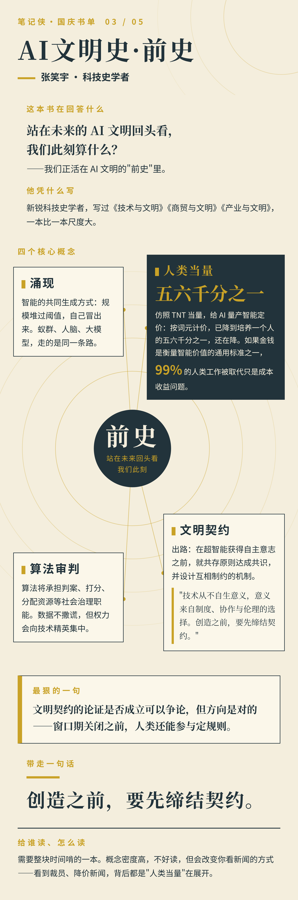
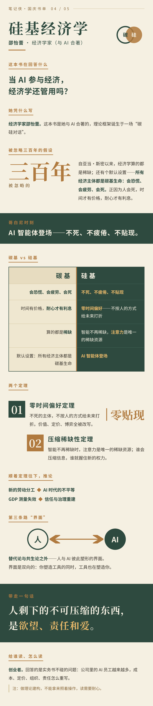

[English](README.md)

# book-infographic

> 把一本书变成一张"像人做的"信息图，而不是 AI 模板。

`book-infographic` 是一个可复用的 skill（工作手册），供 AI 助手使用。输入一本书——书名、原文摘录，或一篇相关文章链接——它会产出一张精致的、编辑风格的信息图 PNG。流程是：先做内容分析，再定版式，最后渲染，发布前还有一道"读者代言人"质检关。

## 工作流程

1. **输入**——书名（+作者）、摘录或文章链接。只有书名时，先查证关键事实；不编造引文、日期和数字。
2. **分类**——从 10 种书籍类型中指定一个主类型（最多加两个次类型）；对不上的类型走定制兜底流程，不硬套。
3. **内容简报**——先用口语化的语言定稿所有标题和文案，再谈版式。
4. **版式简报**——根据信息之间的关系从 7 种版式中选择，定一个放大呈现的核心结论、一个视觉母题和克制的配色。
5. **渲染**——单个 1080px 宽的 HTML，经 `bin/render.py`（Playwright + Chromium）渲染为 2 倍 PNG。
6. **质检**——以手机读者的视角检查 PNG；不通过就打回重做。

铁律：先定文案再做视觉 · 一书一貌（同一批不许复用骨架）· 图形必须承载信息 · 最多三种主色 + 纸色 · 栏目标题用人话，不用"核心概念/作者简介"式八股。

## 书籍类型

| # | 类型 | 分析维度（示例） |
|---|------|----------------|
| 1 | 历史 | 时间线节拍、断代、转折点、一句话历史规律 |
| 2 | 传记 | 人生阶段、关键抉择、性格驱动力、遗产与争议 |
| 3 | 思想/哲学 | 核心论点、概念关系、论证链条、可争论之处 |
| 4 | 社科理论 | 基本假设、核心模型、预测、解释边界 |
| 5 | 自然科学 | 核心机制、关键证据、被推翻的旧认知、开放问题 |
| 6 | 思维方法 | 工具箱（名称+用法+例子）、反直觉点 |
| 7 | 商业/管理 | 关键数字、行动框架、组织落地、失败模式 |
| 8 | 心理/成长 | 核心模型、常见误解、实践步骤、证据强度 |
| 9 | 技术实务 | 核心原理、心智模型、方案对比、常见坑 |
| 10 | 文学虚构 | 故事弧光、人物图谱、人物转变、主题（实验性） |

## 版式模式

时间线 · 工具箱 · 概念地图 · 仪表盘 · 人物弧光 · 对比矩阵 · 因果机制——按信息关系选用，绝不默认套用。

## 示例

五张信息图来自一份中文假期书单，每本书用了不同的版式：

**1. 尼克《人工智能简史（第三版）》**——时间线版式

**2. 马兆远《世界的逻辑》**——工具箱版式

**3. 张笑宇《AI文明史·前史》**——概念地图版式

**4. 邵怡蕾《硅基经济学》**——对比矩阵版式

**5. 李开复《AI未来已来》**——仪表盘版式

## 作为 skill 使用

把整个文件夹复制到你的 AI 助手的 skills 目录，让助手阅读 `SKILL.md` 即可。完整流程、类型—维度库、版式模式和质检清单分别在 `SKILL.md` 和 `references/` 中。

## 环境要求

- Python 3
- Playwright + Chromium：`pip install playwright && python -m playwright install chromium`
- Noto Sans CJK SC / Noto Serif CJK SC（带系统回退），用于中文渲染
